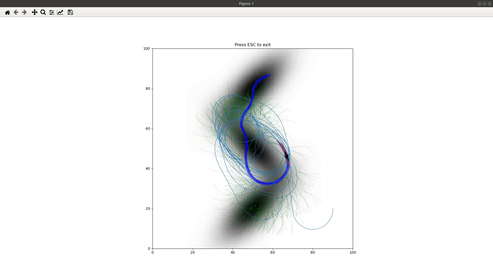

# Pareto Monte-Carlo Tree Search
Demo for the paper "Chen, Weizhe, and Lantao Liu. "Pareto Monte Carlo Tree Search for Multi-Objective Informative Planning." *Robotics: Science and Systems*. 2019".

## Materials
[Accelerated Video](https://youtu.be/mdtgHT2yaU8)

[PDF](http://www.roboticsproceedings.org/rss15/p72.pdf)

[Poster](./media/poster.pdf)

## Installation
* Python 3.6+
* Numpy
* Matplotlib
```bash
pip install numpy matplotlib
pip install -e .
```

## Upper Confidence Bound Applied to Trees (UCT)
```bash
cd ./demo
python uct_demo.py
```

The black blocks in the occupancy grid map are obstacles.
For demonstration purpose, we used an artificial reward map where the upper-right corner has higher reward.
The blue arrows indicate the current best action, the red arrows represent the best trajectory, and the green dots show the searching tree.

## Pareto UCT
```bash
python puct_demo.py
```

Now we provide another reward map where the high-reward area is the upper part.
This time, we chose to go up at the end to balance the two objectives.

## Hotspots

```bash
python hotspots.py
```



## Citing
If you find the code useful for your research, we appreciate citations to the following paper:
```
@inproceedings{chen19pareto, 
    author = {Weizhe Chen and Lantao Liu}, 
    title = {Pareto Monte Carlo Tree Search for Multi-Objective Informative Planning}, 
    booktitle = {Proceedings of Robotics: Science and Systems}, 
    year = {2019}, 
} 
```

## Acknowledgements
The code snippet for parsing pgm file to numpy array was taken from the selected answer of https://stackoverflow.com/questions/7368739/numpy-and-16-bit-pgm. Thanks, cgohlke.
