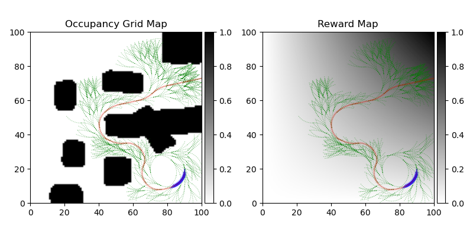
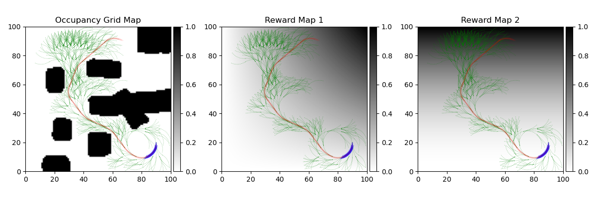

# Pareto Monte-Carlo Tree Search
Demo for the paper "Chen, Weizhe, and Lantao Liu. "Pareto Monte Carlo Tree Search for Multi-Objective Informative Planning." *Robotics: Science and Systems*. 2019".

## Materials
[Accelerated Video](https://youtu.be/mdtgHT2yaU8)

[PDF](http://www.roboticsproceedings.org/rss15/p72.pdf)

[Poster](./media/poster.pdf)

### BibTeX
```
@inproceedings{Liu-RSS-19, 
    author = {Weizhe Chen and Lantao Liu}, 
    title = {Pareto Monte Carlo Tree Search for Multi-Objective Informative Planning}, 
    booktitle = {Proceedings of Robotics: Science and Systems}, 
    year = {2019}, 
    address = {FreiburgimBreisgau, Germany}, 
    month = {June}, 
    doi = {10.15607/RSS.2019.XV.072} 
} 
```

## Requirements
* Python 3
* Numpy
* Matplotlib

## Upper Confidence Bound Applied to Trees (UCT)
```bash
# Stay in /pareto-mcts and execute
python -m demo.uct
# or
./scripts/run_uct.sh
```

The black blocks in the occupancy grid map are obstacles.
For demonstration purpose, we used an artificial reward map where the upper-right corner has higher reward.
The blue arrows indicate the current best action, the red arrows represent the best trajectory, and the green dots show the searching tree.

## Pareto UCT
```bash
# Stay in /pareto-mcts and execute
python -m demo.puct
# or
./scripts/run_puct.sh
```

Now we provide another reward map where the high-reward area is the upper part.
This time, we chose to go up at the end to balance the two objectives.
